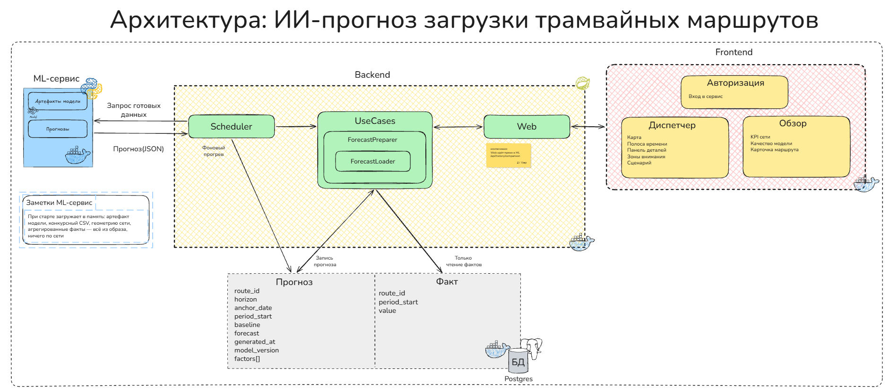
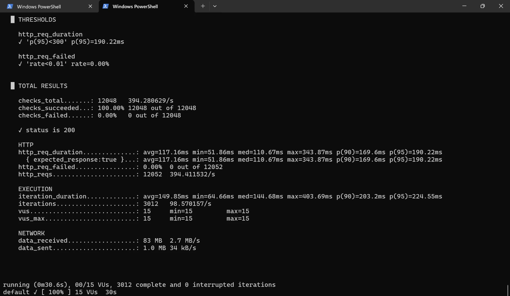

# tram-forecast

ИИ-прогноз загрузки трамвайных маршрутов (Хакатон Московского транспорта). Команда **Manticore**.

**Стенд:** <https://24manticore.ru>


## Оглавление

- [Быстрый старт](#быстрый-старт)
- [1. ML-модель](#1-ml-модель)
- [2. Внешние данные](#2-внешние-данные)
- [3. Запускаемый веб-сервис](#3-запускаемый-веб-сервис)
- [4. Архитектура и модули](#4-архитектура-и-модули)
- [5. Производительность](#5-производительность)
- [6. Ограничения и план развития](#6-ограничения-и-план-развития)
- [Лицензия](#лицензия)

## Быстрый старт

См. «[3. Запускаемый веб-сервис](#3-запускаемый-веб-сервис)».

## 1. ML-модель

- Обучение: [`ml/train.py`](ml/train.py), [`ml/build_artifact.py`](ml/build_artifact.py)
- Инференс (HTTP-сервис): [`ml/app/`](ml/app)
- Артефакт модели: [`ml/artifacts/route_model.json`](ml/artifacts/route_model.json)
- Инструкция запуска: [`ml_readme.md`](ml_readme.md)

## 2. Внешние данные

[Яндекс.Диск](https://disk.yandex.ru/d/_6a1pMQOQNdr9A)

## 3. Запускаемый веб-сервис

Тот же стек круглосуточно работает на <https://24manticore.ru> (Basic-auth, логин/пароль — организаторам отдельно).

Локально — нужен Docker, backend + frontend + ML + Postgres одной командой, без внешних зависимостей:

```bash
docker compose -f docker-compose.local.yml up --build
```

Открыть <http://localhost:8080>, войти: `jury` / `jury-local-demo`. Первая сборка — несколько минут
(Maven, npm, pip качают зависимости), дальше — секунды. Часы внутри зафиксированы на 01.11.2025, начало
периода прогноза, так что «сегодня» сразу попадает в данные. Остановить — Ctrl+C; убрать вместе с БД —
`docker compose -f docker-compose.local.yml down -v`.

Точки входа API: [`docs/openapi.json`](docs/openapi.json) (полный контракт), Swagger UI на
`http://localhost:8080/swagger-ui.html` при поднятом стенде, таблицы эндпоинтов — в разделе 4 ниже.
Пример:

```bash
curl -u jury:jury-local-demo http://localhost:8080/api/meta
curl -u jury:jury-local-demo "http://localhost:8080/api/routes?horizon=day"
```

## 4. Архитектура и модули

Полная схема: [Яндекс.Диск](https://disk.yandex.ru/d/vw3235fPyogFXQ)



### ML ↔ Backend

| Что | Эндпоинт |
|---|---|
| Прогноз по всем маршрутам | `POST /predict/routes` |
| Метрики качества | `GET /metrics?origin=2025-09-01` |
| Историческое сравнение | `GET /history/comparison?date=2025-11-01&routeId=all` |

### Backend ↔ Frontend

| Что | Эндпоинт |
|---|---|
| Карта сети / полоса времени | `GET /api/routes?horizon=day` |
| Панель деталей | `GET /api/routes/{routeId}/forecast?horizon=day` |
| Зоны внимания | `GET /api/attention?horizon=day` |
| Типичная неделя маршрута | `GET /api/routes/{routeId}/load-matrix` |
| Качество модели | `GET /api/model/stats?days=30` |
| Метаданные (даты, горизонты) | `GET /api/meta` |
| Выгрузка в CSV | `GET /api/export?format=csv&horizon=day` |
| История для дня | `GET /api/history/comparison?date=2025-11-01&routeId=all` |

## 5. Производительность

Сервер: **2×3.3 ГГц CPU, 4 ГБ RAM** (весь стек — Postgres, backend, ML, frontend, Caddy). Нагрузочный
тест — [k6](https://k6.io), сценарий [`perf/load.js`](perf/load.js), против боевого стенда.



| Метрика | Значение | Что значит |
|---|---|---|
| RPS (http_reqs) | 394 запроса/с | сколько запросов в секунду выдерживает сервис |
| p95 (http_req_duration) | 190 мс | 95% запросов отвечают быстрее этого времени |
| Ошибки (http_req_failed) | 0% | доля неуспешных запросов |
| Одновременных пользователей (vus) | 15 | сколько параллельных сессий создавало нагрузку |
| Длительность прогона | 30 с | 3012 итераций, 12048 запросов |

Утилизация ресурсов во время теста (`docker stats` на сервере): backend ~131% CPU (без лимита на
контейнер, общий пул сервера), ML ~21% CPU (лимит 1 vCPU) — суммарно **~76% из двух ядер сервера**.
Память стабильна с запасом: backend 18% от 1.5 ГБ, ML 6% от 768 МБ, без swap.

Дополнительные возможности сверх обязательного минимума: [Яндекс.Диск](https://disk.yandex.ru/d/8BPqQMNZpqMGPA).

## 6. Ограничения и план развития

[Яндекс.Диск](https://disk.yandex.ru/d/TalQ6q7CTlHKbQ)

## Лицензия

[MIT](LICENSE)
